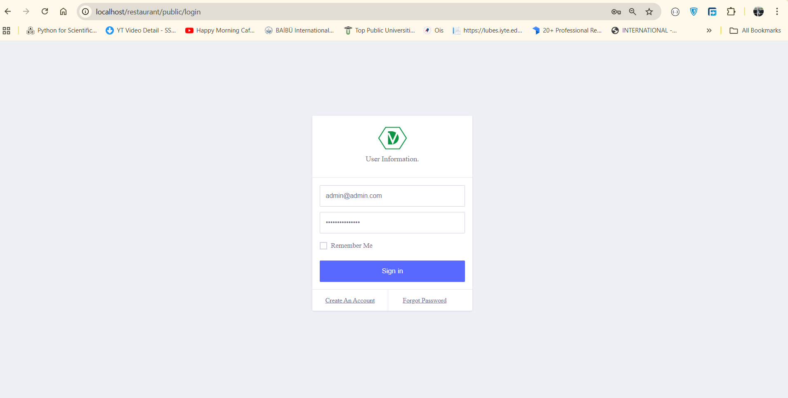
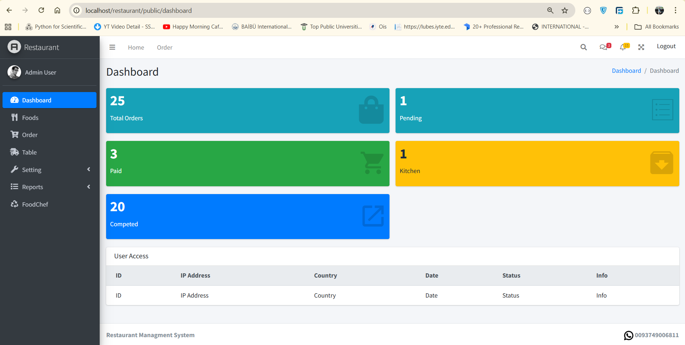
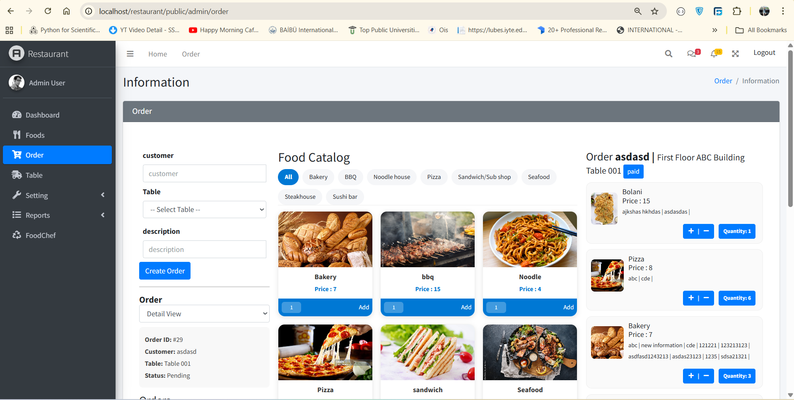

# 🍽️ Restaurant Management System

A comprehensive and user-friendly **Restaurant Management System** built with **Laravel**, designed to streamline restaurant operations such as order handling, menu management, and table tracking — all from one centralized platform.

> 🚫 **Deletion of data is disabled** to prevent accidental data loss.

---

## ⚠️ Important Notice

**Due to hosting service limitations, online demos are no longer available.**

---

## 🚀 Features

- 🧾 **Order Management** – Manage dine-in orders efficiently  
- 🍴 **Menu Management** – Create, edit, and categorize menu items with pricing and availability  
- 📋 **Table Management** – Track table occupancy in real time  
- 📊 **Reports** – General system reporting  
- 🔐 **User Roles & Permissions** – Secure admin-only access  

---

## 💻 Tech Stack

- **Frontend:** Laravel Blade  
- **Backend:** Laravel  
- **Database:** MySQL  
- **Authentication:** OAuth with customized login  
- **Server:** Apache  

---

## 📦 Requirements

Make sure the following are installed on your system:

- PHP (Recommended: PHP 8.x)
- Composer
- MySQL
- Apache Server  

👉 **Recommended:**  
Install **XAMPP or WAMP**, which includes PHP, MySQL, and Apache in one package.

---

## 🛠️ Installation & Local Setup

Follow these steps to run the project locally.

---

### Step 1: Install PHP, Composer & MySQL

- Install PHP and Composer
- Install MySQL
- OR install XAMPP / WAMP (recommended)

---

### Step 2: Clone or Download the Project

Clone using Git:
```bash
git clone https://github.com/abdulnaeemturk/Restaurant-Managment-System.git
```

Or download the repository as a ZIP file and extract it.

---

### Step 3: Move Project to Server Directory

Move the extracted folder to your local server directory:

- XAMPP: `htdocs/`
- WAMP: `www/`

Example:
```
xampp/htdocs/Restaurant-Managment-System
```

---

### Step 4: Install PHP Dependencies

```bash
cd Restaurant-Managment-System
composer install
```

---

### Step 5: Environment Configuration

Create the environment file and generate the app key:

```bash
cp .env.example .env
php artisan key:generate
```

---

### Step 6: Database Configuration

1. Create a MySQL database (example: `restaurant_db`)
2. Update your `.env` file:

```env
DB_DATABASE=restaurant_db
DB_USERNAME=root
DB_PASSWORD=
```

---

### Step 7: Run Migrations & Seeder

```bash
php artisan migrate
php artisan db:seed
```

This will create a default admin user.

---

### Step 8: Run the Application

```bash
php artisan serve
```

Open in browser:
```
http://127.0.0.1:8000
```

If using XAMPP/WAMP:
```
http://localhost/Restaurant-Managment-System/public
```

---

## 🔐 Default Admin Login

```
Email:    admin@admin.com
Password: admin@admin.com
```

---

## 📸 Application Screenshots

### 🔐 Login Page


### 📊 Admin Dashboard


### 🧾 Order Management


---

## 📁 Recommended Folder Structure

```
Restaurant-Managment-System/
│
├── public/screenshots/
│   ├── login.png
│   ├── dashboard.png
│   └── order-management.png
│
├── app/
├── public/
├── resources/
└── README.md
```

---

## 📝 Notes

- Online demos are disabled
- Designed for local or self-hosted deployment
- Data deletion is intentionally disabled

---

## 📜 License

This project is open-source and available for educational and commercial use.

---

## ⭐ Support

If you find this project useful, please consider giving it a ⭐ on GitHub!
